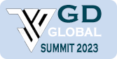
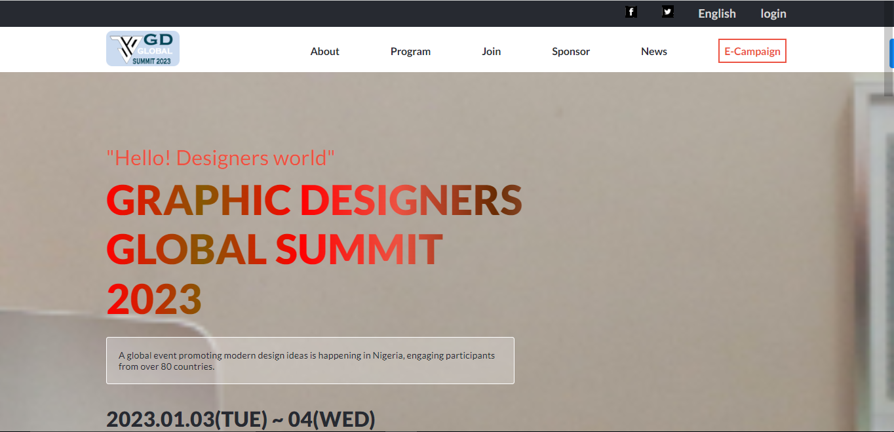

<!--
HOW TO USE:
This is an example of how you may give instructions on setting up your project locally.

Modify this file to match your project and remove sections that don't apply.

REQUIRED SECTIONS:
- Table of Contents
- About the Project
  - Built With
  - Live Demo
- Getting Started
- Authors
- Future Features
- Contributing
- Show your support
- Acknowledgements
- License

After you're finished please remove all the comments and instructions!
-->

  
   

  <h3><b>GD Summit </b></h3>

<!-- TABLE OF CONTENTS -->

# 📗 Table of Contents

- [📖 About the Project](#about-project)
  - [🛠 Built With](#built-with)
    - [Tech Stack](#tech-stack)
    - [Key Features](#key-features)
  - [🚀 Live Demo](#live-demo)
- [💻 Getting Started](#getting-started)
  - [Setup](#setup)
  - [Prerequisites](#prerequisites)
  - [Install](#install)
  - [Usage](#usage)
  - [Run tests](#run-tests)
  - [Deployment](#triangular_flag_on_post-deployment)
- [👥 Authors](#authors)
- [🔭 Future Features](#future-features)
- [🤝 Contributing](#contributing)
- [⭐️ Show your support](#support)
- [🙏 Acknowledgements](#acknowledgements)
- [❓ FAQ](#faq)
- [📝 License](#license)

<!-- PROJECT DESCRIPTION -->

# 📖 [GD_summit] 

**GD_summit** is a project designed to inform the public about this year Graphic Designers Conference Scheduled to hold in Nigeria. 

Here is a [presentation video](https://www.loom.com/share/77c45150212f466c8117d216a2cb36eb)

## 🛠 Built With 

- HTML
-  CSS
-  Javascript

<!-- Features -->

### Key Features 

<li> introduce a forthcoming summit</li>
<li> introduce the guest speakers</li>
<li> show the pictures of the past summit</li>
<li> showcase who won the logo competition</li>
<li> Responsive Version</li>
<li> interactive hamburger menu</li>
<li> see more guest speakers on clicking see more</li>

(<a href="#readme-top">back to top</a>)

<!-- LIVE DEMO -->

## 🚀 Live Demo 

- Here is a [Live Demo Link](https://donmark2k.github.io/GD_summit/)

(<a href="#readme-top">back to top</a>)

<!-- GETTING STARTED -->

## Project Screenshots

(<a href="#readme-top">back to top</a>)

<!-- GETTING STARTED -->

## 💻 Getting Started 

### Prerequisites

In order to run this project you need:
- [git](https://git-scm.com/downloads): A tool for managing source code
- [Visual Studio Code](https://code.visualstudio.com/): A source code editor
- Have a working and updated browser
- Have a local version control like git installed on your computer
- Have an account and sign in on GitHub, as online/remote version control system
- Basic knowledge in JS.

### Setup
To get a local copy of this project up and running, follow these steps.
- copy [this link](https://github.com/Donmark2k/GD_summit.git).
- get to the directory that you want to clone the repository.
- open the command prompt in this directory.
- write `git clone github.com/Donmark2k/GD_summit.git`
- go to the repository folder in your command prompt cd maths-magicians
- write `code .` to open the project in visual studio code.

### Usage
To run the project, execute the following command:

- In visual studio  press `alt + L + O` then the project will open on your browser "http://127.0.0.1:5500/".

### Run tests

- `npx stylelint "/*.{css,scss}"**`: To test css code
- `npx stylelint "**/*.{css,scss}" --fix`: To fix some CSS errors if found.
- `npx eslint .` : To test Eslint Report
- `npx eslint . --fix`: To fix some JS errors if found

### Deployment

You can deploy this project using:
- Github pages

follow <a href="https://www.w3schools.com/git/git_remote_pages.asp?remote=github">these steps</a> for example on hoe to deploy on github pages

(<a href="#readme-top">back to top</a>)

<!-- AUTHORS -->

## 👥 Author 

 👤**Chukwuemeka Ochuba**

- GitHub: [@Donmark2k](https://github.com/Donmark2k)
- Twitter: [@Donmark2k](https://twitter.com/donmark2k)
- LinkedIn: [LinkedIn](https://www.linkedin.com/in/chukwuemeka-ochuba/)

(<a href="#readme-top">back to top</a>)

<!-- FUTURE FEATURES -->

## 🔭 Future Features 

- [1 ] I will include live-chat 

(<a href="#readme-top">back to top</a>)

<!-- CONTRIBUTING -->

## 🤝 Contributing 

Contributions, issues, and feature requests are welcome!

Feel free to check the [issues page](https://github.com/Donmark2k/GD_summit/issues).

(<a href="#readme-top">back to top</a>)

<!-- SUPPORT -->

## ⭐️ Show your support 

[Rita Daniel](https://github.com/RitaDee) has been of tremendous help so far.
- Give a ⭐️ if you like this project!

(<a href="#readme-top">back to top</a>)

<!-- ACKNOWLEDGEMENTS -->

## 🙏 Acknowledgments 
I would like to appreciate [Microverse](https://www.microverse.org/) for providing the learning resources for this exercise, and I would specially thank   [Cindy Shin](https://www.behance.net/adagio07) who is the original author of this [design](https://www.behance.net/gallery/29845175/CC-Global-Summit-2015)

(<a href="#readme-top">back to top</a>)

<!-- FAQ (optional) -->

## ❓ FAQ 

- **[Are you sure that you are owner of this work]**

  - [Yes, I am]

- **[Can you make the work to be responsive]**

  - [yes]

(<a href="#readme-top">back to top</a>)

<!-- LICENSE -->

## 📝 License 

This project is [MIT](MIT.md) licensed.

(<a href="#readme-top">back to top</a>)
