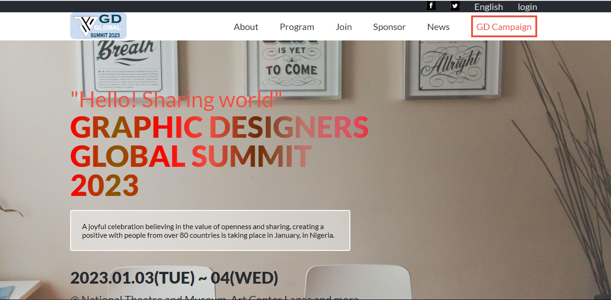

<a name="readme-top"></a>

<!--
HOW TO USE:
This is an example of how you may give instructions on setting up your project locally.

Modify this file to match your project and remove sections that don't apply.

REQUIRED SECTIONS:
- Table of Contents
- About the Project
  - Built With
  - Live Demo
- Getting Started
- Authors
- Future Features
- Contributing
- Show your support
- Acknowledgements
- License

After you're finished please remove all the comments and instructions!
-->

<div align="center">

  
  <br/>

  <h3><b>🕹️🕹️GD Summit 🕹️🕹️</b></h3>

</div>

<!-- TABLE OF CONTENTS -->

# 📗 Table of Contents

- [📖 About the Project](#about-project)
  - [🛠 Built With](#built-with)
    - [Tech Stack](#tech-stack)
    - [Key Features](#key-features)
  - [🚀 Live Demo](#live-demo)
- [💻 Getting Started](#getting-started)
  - [Setup](#setup)
  - [Prerequisites](#prerequisites)
  - [Usage](#usage)
  - [Run tests](#run-tests)
  - [Deployment](#triangular_flag_on_post-deployment)
- [👥 Authors](#authors)
- [🔭 Future Features](#future-features)
- [🤝 Contributing](#contributing)
- [⭐️ Show your support](#support)
- [🙏 Acknowledgements](#acknowledgements)
- [📝 License](#license)

<!-- PROJECT DESCRIPTION -->

# 📖 [GD_summit] <a name="about-project"></a>

**GD_summit** is a project designed to inform the public about this year Graphic Designers Conference Scheduled to hold in Nigeria. 

## 🛠 Built With <a name="built-with"></a>

<details>
  <summary>HTML</summary>
  <ul>
    <li><a href="https://developer.mozilla.org/en-US/docs/Web/HTML">Link to HTML</a></li>
  </ul>
</details>

<details>
  <summary>CSS</summary>
  <ul>
    <li><a href="https://developer.mozilla.org/en-US/docs/Web/CSS">Link to CSS</a></li>
  </ul>
</details>

<details>
  <summary>Javascript</summary>
  <ul>
    <li><a href="https://www.javascript.com/">Link to Javascript</a></li>
  </ul>
</details>


<!-- Features -->

### Key Features <a name="key-features"></a>

- **This Project has a Readme.md file**
- **This Project has a gitignore file**
- **This Project shows the pictures of the past summit**
- **This Project shows who won the logo competition**
- **This project gives details about the Graphics design festival, its date, time and location**


<p align="right">(<a href="#readme-top">back to top</a>)</p>

<!-- LIVE DEMO -->

## 🚀 Live Demo <a name="live-demo"></a>

- Here is a [Live Demo Link](https://donmark2k.github.io/GD_summit/)
- Here is a [presentation video link](https://www.loom.com/share/e87f06686ebc44b4a3965d6800c5121f)

<p align="right">(<a href="#readme-top">back to top</a>)</p>

## Project Screenshots



<p align="right">(<a href="#readme-top">back to top</a>)</p>

<!-- GETTING STARTED -->

## 💻 Getting Started <a name="getting-started"></a>

### Prerequisites

In order to run this project you need:
- [git](https://git-scm.com/downloads): A tool for managing source code
- [Visual Studio Code](https://code.visualstudio.com/): A source code editor
- Have a working and updated browser
- Have a local version control like git installed on your computer
- A copy of the link of this Repository.
```sh
 https://github.com/Donmark2k/GD_summit.git
```

### Setup
Clone this repository to your desired directory using the command: 

```sh
  cd your-folder
  git clone https://github.com/Donmark2k/GD_summit.git 
```

### Usage
Run the server using the following command:

```sh
  alt + L + O
```

<p align="right">(<a href="#readme-top">back to top</a>)</p>

<!-- AUTHORS -->

## 👥 Author <a name="author"></a>

 👤**Chukwuemeka Ochuba**

- GitHub: [@Donmark2k](https://github.com/Donmark2k)
- Twitter: [@Donmark2k](https://twitter.com/donmark2k)
- LinkedIn: [LinkedIn](https://www.linkedin.com/in/chukwuemeka-ochuba/)

<p align="right">(<a href="#readme-top">back to top</a>)</p>

<!-- FUTURE FEATURES -->

## 🔭 Future Features <a name="future-features"></a>

- [ ] **Tickets Page to Join event**
- [ ] **Accommodation Booking Page for travellers**
- [ ] **Individual Event Activity Pages**
- [ ] **Sponsor Page**
- [ ] **Multi-Language implementation for page**
- [ ] **Sign In Page for users to keep unique user details**


<p align="right">(<a href="#readme-top">back to top</a>)</p>

<!-- CONTRIBUTING -->

## 🤝 Contributing <a name="contributing"></a>

Contributions, issues, and feature requests are welcome!

Feel free to check the [issues page](https://github.com/Donmark2k/GD_summit/issues).

<p align="right">(<a href="#readme-top">back to top</a>)</p>

<!-- SUPPORT -->

## ⭐️ Show your support <a name="support"></a>

If you like this project kindly support by suggesting changes through forking and pull requests
<p align="right">(<a href="#readme-top">back to top</a>)</p>

<!-- ACKNOWLEDGEMENTS -->

## 🙏 Acknowledgments <a name="acknowledgements"></a>
I would like to appreciate [Microverse](https://www.microverse.org/) for providing the learning resources for this exercise, and I would specially thank   [Cindy Shin](https://www.behance.net/adagio07) who is the original author of this [design](https://www.behance.net/gallery/29845175/CC-Global-Summit-2015)

<p align="right">(<a href="#readme-top">back to top</a>)</p>

<!-- LICENSE -->

## 📝 License <a name="license"></a>


This project is [MIT](./LICENSE) licensed.

<p align="right">(<a href="#readme-top">back to top</a>)</p>
